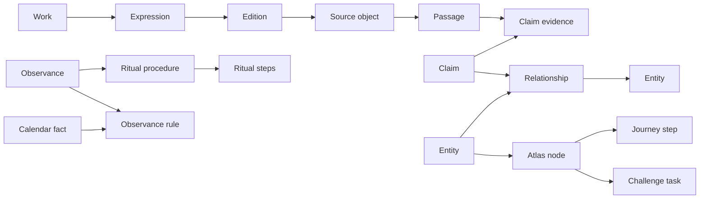

# MVP data and graph model

## Design principle

The graph is a set of typed, evidence-bearing relationships inside Postgres—not a second truth store. The library object and its passage coordinates remain the evidence foundation. Devam synthesis, user-facing story arcs, and Sarthi responses can evolve without rewriting source identity.

## Core layers

### 1. Library identity

- `works` — abstract work identity such as *Valmiki Ramayana*.
- `expressions` — language, recension, translation, commentary, or adaptation identity.
- `editions` — publisher/editor/date/edition-specific identity.
- `source_objects` — immutable acquired bytes, provenance, content hash, media type, and rights lane.
- `passages` — source-relative address, text or image coordinates, language/script, and citation label.

No row above claims that a source is complete merely because it was acquired. Edition, expression, and work completeness are separate review fields.

### 2. Knowledge and evidence

- `entities` — people, deities, places, texts, festivals, rituals, philosophical concepts, plants, practices, dynasties, kingdoms, events, and objects.
- `claims` — atomic statements with time, geography, tradition, confidence, and review state.
- `claim_evidence` — many-to-many binding from claims to exact passages or research sources.
- `relationships` — typed entity-to-entity edges that optionally point to the claim establishing the relationship.
- `names` — multilingual labels, transliterations, aliases, and historical names.
- `traditions` and `regions` — explicit applicability dimensions rather than prose-only caveats.

Conflicting claims coexist. A preferred narrative is a presentation decision, not destructive canonicalization.

### 3. Living practice

- `observances` — festival, vrata, weekday, lunar-day, seasonal, and life-event practices.
- `ritual_procedures` — applicability plus minimum, standard, and elaborate variants.
- `ritual_steps` — ordered actions with materials, substitutions, timing, recitation, and cautions.
- `observance_rules` — deterministic rules that connect calendar facts and local tradition to an observance.
- `calendar_facts` — computed Panchang result with coordinates, timezone, engine version, and ruleset version.

The language model may explain a calendar fact but never invent or calculate it implicitly.

### 4. Exploration product

- `atlas_nodes` — an entity or editorial story-world destination with map/time/visual metadata.
- `atlas_edges` — traversable, labelled connections shown to users.
- `journeys` and `journey_steps` — authored narrative paths.
- `challenges` and `challenge_tasks` — optional exploration or real-world missions.
- `content_cards` — localized editorial presentation bound back to claims, passages, or procedures.

### 5. User and Sarthi

- `profiles` — explicit language, location, and tradition preferences.
- `conversation_threads` and `messages` — user-owned conversation state.
- `memory_proposals` and `memories` — inspectable, consented, editable companion memory.
- `saved_items`, `journey_progress`, and `challenge_progress` — user-owned product state.
- `retrieval_runs` — internal trace of queries, retrieved evidence IDs, model/config, latency, and cost.
- `response_feedback` — user rating and correction signal, separate from canonical knowledge.

## Relationship overview

## Rights lanes

Every source, passage projection, image, content card, and generated derivative has an explicit lane:

1. `private_evidence` — available only to authorized internal research and validation.
2. `citation_only` — identity/citation may be shown; carrier or substantial text may not.
3. `product_allowed` — may be retrieved and displayed within its recorded conditions.
4. `derivative_allowed` — may be transformed, translated, embedded, or used for generated media within recorded conditions.

Rights are inherited conservatively: a derived row cannot receive a broader lane than its governing source without a separate authorization record.

## MVP RLS boundary

| Data family | Anonymous | Authenticated user | Editorial service |
|---|---:|---:|---:|
| Product-allowed Atlas/library cards | read | read | write |
| Private evidence and research traces | no | no | read/write |
| User profile, memory, saved state | no | own rows only | narrowly scoped support access |
| Conversation and feedback | no | own rows only | asynchronous processing by service |
| Canonical claims/procedures | read only when published | read only when published | write with audit identity |

RLS and explicit Data API grants are both required. The browser never receives service-role credentials.

## Retrieval contract

Each Sarthi answer packet contains:

- normalized intent and requested language;
- user-approved context and active Atlas node;
- deterministic facts, if any;
- retrieved passage IDs and claim IDs;
- conflicts or applicability constraints;
- rights-filter decision;
- generation model/prompt version; and
- a concise answer plus optional evidence expansion.

Exact-answer mode returns the cited fact or passage with minimal synthesis. Companion mode uses the same evidence packet but may provide a warmer, practical interpretation. Neither mode promotes model-generated prose into canonical library truth.

Private evidence may still be indexed in `passages.search_document` for
server-side editorial research and source reconciliation. That index does not
make the text product-usable: browser policies deny the canonical evidence
tables, and the public search RPC admits only published product-compatible
claims and evidence. Source metadata and graph relationships may be retained in
review state even when the governing carrier cannot be quoted or republished.
