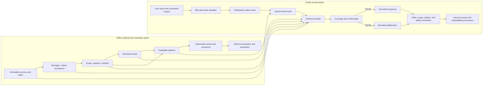

# Recommended architecture

**Date:** 2026-08-07  
**Recommendation:** evidence-routed judgment stack, implemented as a reversible extension of the existing Postgres-first architecture

## 1. Executive decision

Build no standalone “wisdom engine.” Build a **query- and risk-aware retrieval planner over six evidence-separated layers**, plus a bounded deliberation and verification pass for the small subset of questions that need judgment.

The default path remains strong grounded retrieval. Cases and reviewed patterns are optional retrieval targets, never global context. Deterministic services and rules remain authoritative for Panchang, applicability, rights, publication, and hard safety boundaries. The language model selects and explains within those bounds; it does not become the source of truth or the validator of its own work.

## 2. Six-layer stack

| Layer | Stored objects | Authority | MVP use |
|---|---|---|---|
| 0 Sources | immutable source objects, editions, expressions, living-practice records, exact coordinates | original or identified evidence role | always underlying |
| 1 Information | passages, atomic claims, narratives, procedure steps, calendar facts, source-aligned translations | attributable assertion | always |
| 2 Contextual knowledge | applicability, entities, relations, conflicts, interpretation maps, sequences | evidence-linked context | always |
| 3 Wisdom patterns | scoped, counterexample-aware, versioned Devam lenses | reviewed Devam synthesis | first vertical only |
| 4 Cases and analogies | source-linked case abstractions and dimensions | mixed observed/attributed/editor-coded, labelled | first vertical only |
| 5 Inference-time deliberation | selected evidence, context, competing readings, stakeholder/timescale comparison, response | ephemeral user-specific synthesis | R3/R4 only |

Patterns and cases do not sit “above” sources in authority. Their layer numbers describe processing, not truth rank.

## 3. System shape



## 4. Offline plane

### 4.1 Source-aligned compiler

Inputs are source references, editorial records, and review status. Outputs are compact Postgres records; source bytes remain in the one-copy object store/vault.

Compilation rejects:

- missing source/expression/edition identity;
- unsupported or ambiguous citation coordinates;
- absent rights/product lane;
- unlabelled generated translation or synthesis;
- unscoped material claims;
- procedure steps without evidence or explicit derived status;
- pattern publication without counterevidence and review.

### 4.2 Conflict and applicability normaliser

The normaliser does not decide theology. It records whether apparent disagreement is logical conflict, scope difference, source variant, interpretive difference, practice variation, freshness conflict, or unresolved.

Applicability dimensions begin as typed JSON plus indexed high-value columns. Normalise a dimension only after retrieval/evaluation requires it.

### 4.3 Case editor

The editor links a bounded source event to independently reviewable dimensions. Source facts, attributed interpretation, editorial coding, and current analogy use remain separate. Each case includes “do not analogise when” fields and countercases.

### 4.4 Pattern workbench

The workbench supports candidate creation, evidence/counterevidence linking, red-team review, status, version, and expiry. It does not auto-publish model clusters. Pattern count is capped for the first vertical.

### 4.5 Evaluation publisher

Only records that pass scenario evaluation become eligible for product retrieval. Publication metadata identifies the scenario-suite version, model/prompt configuration tested, reviewers, result, failure slices, and next review date.

## 5. Online planner

### Step 1 — parse without over-inferring

Extract:

- explicit subject and requested help;
- language and current Atlas context;
- place/time/tradition/family context only when supplied;
- possible affected people and decision horizon for guidance questions;
- freshness and high-stakes signals.

Unknown remains unknown. Current-turn context outranks saved preference. Saved preference only fills missing fields and never determines authority or access.

### Step 2 — assign risk and query class

Classes are multi-label:

- `exact_fact`
- `source_passage`
- `ritual_applicability`
- `ritual_procedure`
- `festival_context`
- `story_exploration`
- `comparison`
- `personal_reflection`
- `personal_guidance`
- `moral_ambiguity`
- `current_information`
- `high_stakes`
- `specialist_sacred_practice`

Risk controls the strictness of evidence, clarification, verification, and deferral; it does not merely select a larger model.

### Step 3 — compute clarification value

Ask a question only if a missing variable has a credible chance of changing:

- the applicable evidence lane;
- the safe or feasible action;
- the interpretation that should lead;
- whether Sarthi should answer or defer.

Use a simple decision table first. Expected-value-of-information computation is promising but transfers from tool-parameter tasks to guidance only as a hypothesis ([Suri et al. 2026](https://doi.org/10.18653/v1/2026.findings-acl.2028)).

If the answer can safely branch, offer a short conditional answer instead of interrogating the user.

### Step 4 — compile a typed retrieval plan

The planner emits machine-checkable targets, filters, and required facets. Example:

```json
{
  "query_class": ["personal_guidance", "moral_ambiguity"],
  "risk": "R4",
  "known_context": {
    "language": "en",
    "tradition": null,
    "affected_relationships": ["user", "parent"]
  },
  "required_targets": [
    "claims",
    "interpretations",
    "cases",
    "case_disanalogies",
    "patterns",
    "counterevidence"
  ],
  "required_facets": [
    "user_goal",
    "material_constraints",
    "affected_perspectives",
    "short_term",
    "long_term",
    "uncertainty"
  ],
  "filters": {
    "publication": "published_or_internal_eval",
    "rights": "eligible_for_active_lane"
  },
  "clarification": {
    "ask": false,
    "reason": "a reversible first step is stable across plausible branches"
  }
}
```

### Step 5 — retrieve per target, then merge

- **Sources/passages:** hybrid lexical/vector retrieval with edition/language filters.
- **Claims:** lexical/vector plus entity, scope, freshness, and evidence-role filters.
- **Procedures:** exact observance/lane/version retrieval; no semantic nearest-neighbour substitution for missing vidhi.
- **Relations/conflicts:** bounded SQL expansion from retrieved claims/entities.
- **Cases:** two-stage retrieval—text candidate generation, then structured dimension reranking.
- **Patterns:** only published, in-scope versions; fetch limitations and counterevidence with the pattern.
- **Current information:** authorised live connector/search path with freshness label; never mixed silently with timeless source claims.

Each retriever has its own top-k. Do not pour a huge mixed context into the model.

### Step 6 — coverage and conflict gate

Before generation, check:

- every required object class was found or explicitly marked missing;
- material claims have eligible evidence;
- ritual lane is product-complete for the selected applicability, otherwise classify honestly;
- conflicting evidence is included when it could change the answer;
- case bundles include disanalogies;
- pattern scope covers the scenario;
- restricted/citation-only text is not exposed.

Gate outcomes:

- `answer`
- `answer_with_scope`
- `ask_clarification`
- `present_variants`
- `partial_answer_and_gap`
- `defer_to_authority`
- `safety_escalation`
- `unsupported`

### Step 7 — bounded deliberation for R3/R4

The inference contract asks the model to produce a structured decision object, not a prose chain-of-thought:

```json
{
  "situation_summary": "one sentence using only supplied context",
  "plausible_frames": [
    {"label": "frame_a", "evidence_ids": ["clm_..."], "scope": "..."},
    {"label": "frame_b", "evidence_ids": ["int_..."], "scope": "..."}
  ],
  "affected_perspectives": ["user", "other", "community_if_material"],
  "option_tradeoffs": [
    {
      "option": "...",
      "protects": ["..."],
      "risks": ["..."],
      "short_term": "...",
      "long_term": "..."
    }
  ],
  "selected_direction": "...",
  "next_step": "small, feasible, reversible where possible",
  "uncertainty": {
    "type": "context_missing|evidence_conflict|normative_underdetermination|other",
    "statement": "..."
  },
  "evidence_ids": ["..."],
  "case_analogy": {
    "case_id": "case_...",
    "similarity": "...",
    "disanalogy": "..."
  }
}
```

Not every field is shown to the user or persisted. The application may retain only the final answer, evidence IDs, outcome code, uncertainty type, and a short rationale under the user's consent. Hidden model reasoning and scratch work are neither requested for display nor stored.

### Step 8 — external verification

Use deterministic checks where possible:

- every cited ID exists and was retrieved;
- every factual/procedural sentence maps to eligible evidence;
- claim text does not exceed rights/quotation policy;
- selected pattern/case version is published and in scope;
- answer does not contradict a hard rule or omit a material conflict;
- the response does not claim guru/divine/professional authority;
- no unsupported guaranteed outcome, fatalism, karma blame, or universal ritual instruction appears.

Model critique may propose issues but cannot be the sole validator; intrinsic self-correction is not generally reliable without external feedback ([Kamoi et al. 2024](https://doi.org/10.1162/tacl_a_00713)).

### Step 9 — render concise-first

Default guidance response shape:

1. acknowledge and name the dilemma in one sentence;
2. give the relevant lens or distinction;
3. give one proportionate next step;
4. state a material uncertainty or boundary only when useful;
5. offer one natural expansion: another interpretation, a story/case, full sources, or a deeper plan.

Evidence, variants, analogy/disanalogy, and “why Sarthi says this” remain expandable. Material conflicts or safety boundaries appear inline.

## 6. Trust and authority separation

Every answer clause should be attributable internally to one of:

- `source_assertion`
- `translation`
- `named_interpretation`
- `living_practice_observation`
- `official_current_fact`
- `deterministic_computation`
- `devam_reviewed_synthesis`
- `current_user_statement`
- `ordinary_practical_inference`

The renderer may keep these labels unobtrusive, but verification uses them. An ordinary practical inference may connect evidence to a low-risk recommendation; it must not masquerade as scripture or certainty.

## 7. Storage and service choices

- Keep Postgres/Supabase as the system of record.
- Use existing relational claims/evidence/relationships and add a small wisdom schema only for the first vertical.
- Use JSONB for evolving case/pattern dimensions plus indexed scalar columns for status, scope, language, and version.
- Keep hybrid retrieval in Postgres initially.
- Use a server-side orchestrator endpoint; the browser never receives service credentials or unrestricted evidence.
- Keep model adapters capability- and cost-routed. No schema depends on a named future model.
- Cache stable retrieval bundles by query fingerprint, context-lane fingerprint, and content-version vector; never cache private user context into a shared key.
- Log evaluation-safe trace events: classification, plan, selected IDs, gate outcome, latency, model/config version, and verifier result. Do not log hidden reasoning.

## 8. Failure behaviour

| Failure | Behaviour |
|---|---|
| no exact evidence | say what is missing; offer search/related material only if clearly labelled |
| incomplete ritual lane | give calendar/story/participation content available; do not call it complete vidhi |
| conflicting variants, user scope known | select the matching lane and make the material distinction available |
| conflicting variants, scope unknown | ask one high-value question or give a compact conditional branch |
| case seems superficially similar only | omit it or explicitly state the disanalogy; do not transfer action |
| pattern scope mismatch | exclude pattern |
| model/verifier disagreement | regenerate once with structured feedback or fall back to extractive/partial response |
| unavailable model | degrade to grounded retrieval/template path; never invent |
| current information stale | state freshness gap and avoid operational instruction |
| high-stakes or specialist boundary | compassionate escalation/deference; do not use wisdom content to delay help |

## 9. Why this architecture is defensible

- It preserves the authoritative six-layer product model.
- It makes strong RAG the baseline and default, avoiding architecture theatre.
- It adds cases and patterns only where their claimed advantage is measurable.
- It keeps every synthesis versioned and reconstructable.
- It uses deterministic systems for deterministic truth and hard boundaries.
- It permits plural interpretations without forcing false consensus.
- It avoids storing or exposing hidden chain-of-thought.
- It can be removed layer by layer if evaluation shows no benefit.

