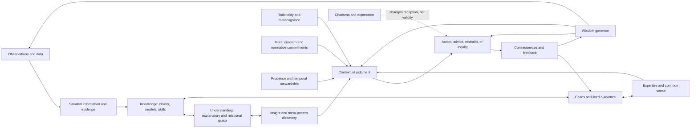

# Construct taxonomy: from representations to wise action

**Date:** 2026-08-07  
**Purpose:** distinguish the target capabilities before choosing an implementation  
**Epistemic status:** evidence-backed conceptual synthesis; definitions are operational research contracts, not claims of final philosophical consensus

## 1. The first correction: replace a ladder with a lattice

The familiar sequence—data → information → knowledge → wisdom—captures a valuable intuition: having more records is not the same as understanding or knowing what to do. It becomes misleading when treated as a one-way production line.

A better model has three interacting dimensions:

1. **Representational products:** data, information, knowledge, understanding, cases, explanations, models.
2. **Cognitive capabilities:** intelligence, expertise, insight, rationality, common sense, judgment.
3. **Orienting and governing capabilities:** morality, prudence, practical wisdom, broader wisdom.

Communication qualities such as clarity and charisma influence whether any of these are trusted or acted upon, but do not establish their quality.

The relations are many-to-many. Wisdom can determine what data deserve collection. Common sense determines how observations are interpreted. Insight can restructure a knowledge field before new data arrive. Expertise can supply fast judgments without explicit explanation. Moral concern can change the objective rather than merely optimize it. Consequences can force revision of every layer.



This diagram is a research model, not a proposed software stack.

## 2. Definitions of representational products

### 2.1 Data

**Operational definition:** recorded distinctions produced by an observation, measurement, transcription, event, or encoding process, before they are assigned a role in answering the present question.

Examples include a temperature reading, transaction timestamp, verse transcription, interview recording, or user action. “Raw” does not mean neutral: instruments, categories, sampling, and recording choices already shape data.

**Pass condition:** provenance identifies what was observed or encoded, by whom or what, when, how, and with what known error.

**Not data quality:** volume, precision-looking decimals without valid measurement, or undocumented text scraped from unknown sources.

### 2.2 Information

**Operational definition:** data interpreted within a question, code, comparison, or model so that it makes a difference to an epistemic or practical state.

A series of sales records becomes information about seasonality only relative to a time model and comparison. A passage becomes information about a ritual only after language, genre, referent, and context are interpreted.

**Pass condition:** the interpretation and task relation are explicit enough to challenge.

**Failure modes:** decontextualization, spurious pattern, selection bias, mistranslation, and treating correlation as explanation.

### 2.3 Evidence

**Operational definition:** information bearing for or against a specified claim, hypothesis, interpretation, or action under an explicit warrant.

Evidence is included because information does not become knowledge merely by aggregation. The same observation can be strong evidence for one claim, weak evidence for another, and irrelevant to a third.

**Pass condition:** claim, direction, warrant, independence, quality, and defeaters are inspectable.

### 2.4 Knowledge

**Operational definition:** sufficiently warranted and reliably retrievable competence or representation that supports true-enough description, prediction, explanation, or action within a declared scope.

This includes:

- **declarative knowledge:** knowing that;
- **procedural knowledge:** knowing how;
- **causal knowledge:** knowing what changes what under which intervention;
- **relational/structural knowledge:** knowing how entities and propositions fit together;
- **conditional knowledge:** knowing when and where a claim or procedure applies;
- **tacit or sensorimotor know-how:** skilled performance not fully expressible as propositions;
- **social and institutional knowledge:** knowing roles, practices, authority, and coordination.

**Pass condition:** warranted performance within scope plus ability to identify important boundaries or defeaters.

**Not sufficient for wisdom:** one may know how to manipulate people, price derivatives, perform a rite, or win a war without knowing whether, when, or for whose benefit to do so.

### 2.5 Understanding

**Operational definition:** grasp of significant dependency, explanatory, compositional, causal, or functional relations such that the system can answer relevant why/how/what-if questions, transfer to structurally related cases, and identify where the model breaks.

Understanding is stronger than repeating an explanation. It is probed through:

- intervention and counterfactual questions;
- prediction under changed surface details;
- explanation at more than one level of abstraction;
- generation of disconfirming cases;
- transfer with disanalogy detection;
- compression that preserves causally or normatively material details.

Understanding can be deep yet morally neutral. A con artist may understand trust dynamics exceptionally well.

## 3. Definitions of cognitive capabilities

### 3.1 Intelligence

**Operational definition:** capacity to acquire and represent patterns or rules, learn from experience, reason, solve problems, plan, and adapt goal-directed behavior across a specified distribution of tasks and environments with bounded resources.

Intelligence concerns *capability and adaptation*. Its measurement always depends on the task/environment distribution, resource budget, and goal definition.

**Characteristic evidence:** learning efficiency, transfer, planning quality, problem-solving range, predictive accuracy, and performance under novelty.

**Dissociation from wisdom:** an intelligent system can efficiently pursue a myopic, harmful, illegitimate, or misunderstood goal. Intelligence can also be used to rationalize a preferred conclusion.

### 3.2 Expertise

**Operational definition:** reliably superior discrimination, prediction, judgment, or action in a bounded domain, produced by structured knowledge and learned representations under sufficiently valid practice and feedback.

Expertise normally includes:

- organized domain schemas and retrieval structures;
- recognition of diagnostically important cues;
- procedural fluency;
- a repertoire of cases and exceptions;
- sensitivity to domain-specific error;
- performance demonstrably better than an appropriate comparison group.

**Necessary qualification:** years, credentials, publication count, confidence, and reputation are not expertise measures by themselves. Intuition deserves trust only where the environment has learnable regularity and feedback was sufficiently fast and accurate.

**Dissociation from wisdom:** expertise is usually narrow. An expert can optimize a local system while ignoring externalities, misuse status outside the domain, or pursue unethical ends.

### 3.3 Insight

**Operational definition:** a nontrivial representational change that reveals a previously unnoticed relation, mechanism, framing, compression, or solution and thereby improves explanation, prediction, search, or action.

The *product* can be gradual even when the conscious experience feels sudden. Insight includes but is not limited to an Aha experience.

**Insight quality tests:** novelty relative to prior representation; explanatory or predictive gain; structural rather than superficial fit; compression without lost material exceptions; independent validation; scope; and productive new questions.

**Dissociation from wisdom:** false insights feel compelling. A deep insight into addictive behavior can enable exploitation. A true meta-pattern can be irrelevant to what should be done.

### 3.4 Meta-pattern recognition

**Operational definition:** induction of a higher-order relational schema that recurs across multiple lower-level patterns while preserving the boundary conditions and transformations that make the recurrence valid.

A meta-pattern is not merely a broad slogan. It must specify:

```text
relational structure
+ source cases
+ invariant and varying features
+ generative or causal account where possible
+ scope and context
+ counterexamples and failure modes
+ predictions or decisions improved
```

Comparison across at least two structurally similar cases helps generate a schema; deliberately different cases and counterexamples are needed to prevent overgeneralization.

**Relation to wisdom:** meta-pattern formation is a powerful form of insight and understanding. Wisdom is displayed when the pattern is validated, scoped, related to legitimate ends and consequences, and applied—or deliberately not applied—well.

### 3.5 Rationality

**Operational definition:** quality of belief formation, inference, deliberation, and action relative to explicit epistemic, instrumental, procedural, and resource-sensitive norms.

At least four forms must remain distinct:

- **epistemic rationality:** beliefs respond appropriately to evidence and truth-directed norms;
- **instrumental rationality:** actions effectively advance declared ends;
- **procedural rationality:** the reasoning process uses defensible procedures;
- **ecological/resource rationality:** the process fits the environment, stakes, time, and computation available.

**Dissociation from wisdom:** instrumental rationality takes ends as given. Epistemically rational actors can disagree because evidence, priors, models, or standards differ. Excessive analysis can itself be irrational under urgency. None of these alone makes ends humane or judgments wise.

### 3.6 Metacognition

**Operational definition:** monitoring and control of one's own cognitive operations: estimating uncertainty and competence, detecting conflict or anomaly, selecting a reasoning mode or tool, allocating effort, seeking information, deferring, stopping, and revising.

**Measurable dimensions:** calibration, discrimination between correct and incorrect states, sensitivity to distribution shift, appropriate tool/effort selection, revision when evidence changes, and knowing when escalation has positive value.

**Dissociation from wisdom:** accurate knowledge of one's ignorance can produce paralysis; excellent control can pursue a bad goal. Metacognition is a leading candidate for a necessary coordinator, not a sufficient definition of wisdom.

### 3.7 Common sense

**Operational definition:** a defeasible repertoire of high-coverage priors, scripts, affordances, expectations, and default inferences about ordinary physical, social, linguistic, and institutional situations, learned through development and participation in an environment.

It includes:

- intuitive physics and object persistence;
- everyday temporal and spatial expectations;
- agents, intentions, roles, emotions, and social scripts;
- affordances and practical substitutions;
- conversational implicature and relevance;
- what ordinarily happens unless an exception is signaled.

**Dissociation from truth and morality:** common sense is local and revisable. It can preserve superstition, hierarchy, exclusion, stereotype, or obsolete practice. It is a prior and anomaly detector, never an authority that “most people believe, therefore true/right.”

### 3.8 Judgment

**Operational definition:** selection of the contextually appropriate interpretation, standard, option, response, confidence, or non-action when evidence, rules, goals, and consequences are incomplete or in tension.

Judgment is where general representations meet particulars. It includes:

- situation framing and detection of what matters;
- relevance and salience selection;
- comparison of options and reasons;
- recognition of exceptions;
- proportionate confidence and precision;
- timing, escalation, and reversibility;
- commitment to a decision when delay also has costs.

**Dissociation from outcome:** a defensible decision can have a bad stochastic outcome, and a reckless decision can get lucky. Evaluation must score process ex ante and outcomes longitudinally.

### 3.9 Creativity

**Operational definition:** production of ideas or artifacts that are both novel relative to a reference set and useful or fitting relative to a task.

Creativity expands candidate space; insight may restructure it. Neither selects worthy ends, validates truth, or manages consequences. A wisdom architecture needs generativity, but must not confuse novelty with value.

## 4. Orienting and governing capabilities

### 4.1 Morality

**Operational definition:** the family of capacities and commitments involved in perceiving morally relevant features, judging claims about right/wrong/good/obligation/rights/virtue, motivating appropriate regard, and acting in relation to affected beings and institutions.

Keep at least four functions separate:

1. **moral sensitivity:** recognizing stakeholders, vulnerability, rights, intentions, power, and possible harms or goods;
2. **moral judgment:** comparing principles, duties, virtues, consequences, relationships, and precedents;
3. **moral motivation:** giving moral reasons appropriate priority against convenience or self-interest;
4. **moral action and repair:** executing, monitoring, accepting accountability, and repairing harm.

No architecture should silently equate morality with majority preference, one constitutional list, legal compliance, one religion, utility maximization, compassion alone, or model refusal behavior.

### 4.2 Prudence

The word has two important uses that should not be conflated.

**Narrow prudence:** intelligent, long-horizon stewardship of an agent's own interests, commitments, health, resources, reputation, optionality, and risk.

**Broad/classical practical wisdom (phronesis):** context-sensitive discernment of how to act well, integrating worthy ends, particulars, virtues, emotion, and conflicting goods.

This programme uses *prudence* for the narrower construct and *practical wisdom* for the broader one. Prudence contributes temporal horizon, downside protection, patience, reversibility, and optionality. It can still be selfish, cowardly, or unjust.

### 4.3 Practical wisdom or phronesis

**Operational definition:** context-sensitive competence in perceiving morally and practically salient particulars, integrating relevant knowledge, experience, emotions, values, relationships, and consequences, and selecting proportionate action toward defensible human or ecological goods.

Phronesis is action-centered and normatively substantive. It is narrower than the programme's full definition of wisdom because theoretical, contemplative, civilizational, or epistemic wisdom may not terminate in an immediate action.

### 4.4 Wisdom

**Provisional operational definition:**

> Wisdom is the reliably demonstrated, context-sensitive meta-competence to frame what matters, discover and test relevant relationships and meta-patterns, coordinate knowledge, expertise, insight, rationality, common sense, moral concern, and prudence, and choose, communicate, enact, or withhold proportionate responses under uncertainty in ways that remain truth-responsive, perspective-aware, temporally farsighted, corrigible, and oriented toward defensible flourishing.

“Reliably demonstrated” excludes a lucky aphorism. “Meta-competence” says that wisdom governs the deployment and conflict of other capabilities; it does not claim a mysterious extra substance. “Defensible flourishing” is deliberately not “the system's reward”: it requires declared normative commitments, contestation, protection against domination, and domain legitimacy.

### 4.5 What this definition does not settle

It does not settle whether:

- wisdom is one latent capacity or a family resemblance;
- a system without consciousness, emotion, mortality, personal stake, or moral responsibility can literally possess it;
- flourishing has a universal core or only overlapping, contested conceptions;
- human wisdom is fundamentally individual or distributed through relationships and institutions.

The architecture can target functional performance while these metaphysical and normative questions remain open. Product claims must say **wisdom-supporting** or **functionally wisdom-like** until longitudinal evidence justifies more.

## 5. Social presentation and dangerous confounds

### 5.1 Charisma

**Operational definition:** capacity to attract attention, evoke trust, confer meaning, coordinate emotion, or motivate action through presence, narrative, rhetoric, identity, symbolism, and delivery.

Charisma can amplify true insight and compassionate leadership. It can equally amplify nonsense, manipulation, cultic authority, and overconfidence. For AI, fluency, warmth, personalization, confidence, metaphor, brevity, and polished structure can act as synthetic charisma.

**Architecture rule:** generation of options and judgments must be separated from persuasive rendering. Evaluation should compare semantically equivalent answers with rhetoric randomized or stripped.

### 5.2 Eloquence, profundity, and perceived wisdom

A statement may seem deep because it is abstract, compressed, paradoxical, emotionally resonant, attributed to a prestigious speaker, or difficult to falsify. This is not yet insight. Require an expansion test:

1. What exactly is the claim?
2. What mechanism or relation does it identify?
3. What cases support it?
4. What would falsify it?
5. Where does it not apply?
6. What prediction or decision changes?

If these cannot be answered, label the statement a **provocation**, **metaphor**, or **hypothesis**, not an insight or wisdom pattern.

### 5.3 Empathy and compassion

- **cognitive empathy:** modeling another's perspective or state;
- **affective empathy:** sharing or resonating with affect;
- **compassion:** noticing suffering or need with concern and motivation to help;
- **care:** sustained relational attention and responsibility.

These can improve moral sensitivity but can be parochial, manipulable, exhausting, or paternalistic. Compassion does not establish factual accuracy or just distribution. A wise process integrates care with truth, autonomy, rights, justice, and consequences.

## 6. Discrimination matrix

| Construct | Primary question | Typical scope | What validates it | Canonical failure despite strength | Not equivalent to |
|---|---|---|---|---|---|
| Data | What was recorded? | event/measurement | fixity, provenance, measurement validity | precise garbage | information |
| Information | What difference does this make to a question? | task/model | correct interpretation and relevance | spurious pattern | knowledge |
| Knowledge | What can be warranted or reliably done? | declared domain | truth/reliability, warrant, scoped performance | powerful harmful know-how | understanding/wisdom |
| Understanding | Why/how/what-if? | system/model | explanation, counterfactuals, transfer, boundary recognition | understanding manipulation | morality |
| Intelligence | Can it learn, solve, and adapt? | task distribution | performance and transfer under resources | optimizing a bad goal | rationality/wisdom |
| Expertise | Can it perform exceptionally here? | bounded domain | comparative real performance and valid feedback | confident error outside domain | broad intelligence/wisdom |
| Insight | Did the representation materially improve? | problem/model | independent explanatory/predictive/action gain | compelling false Aha | truth/wisdom |
| Rationality | Is belief/action procedurally fit to evidence, goals, and resources? | decision class | coherence, calibration, expected performance | rational evil or myopia | morality/wisdom |
| Metacognition | Does it know/control how it is thinking? | cognitive process | calibrated monitoring and beneficial control | calibrated paralysis | wisdom |
| Common sense | What normally follows here? | ecology/culture | high coverage plus exception sensitivity | prejudice as default | universal truth/morality |
| Judgment | What fits these particulars now? | situation | ex-ante reasons, proportionality, outcome learning | lucky recklessness | outcome alone |
| Morality | What is owed, permitted, good, or harmful? | affected moral field | reasons, legitimacy, consistency, action/repair | righteous ignorance | rationality |
| Prudence | What protects longer-term agency and interests? | agent/time | resilience, optionality, downside control | selfish caution | morality |
| Practical wisdom | How should one act well here? | concrete practice | integrated discernment and consequences | paternalistic “good” | rule compliance |
| Wisdom | What matters, how should all relevant capacities be coordinated, and when should one act or refrain? | cross-level, temporal, relational | process + transfer + outcomes + corrigibility + legitimate values | wise-looking overreach | charisma |
| Charisma | Will people attend, trust, and follow? | audience | influence and reception | persuasive nonsense | any epistemic quality |

## 7. Counterexample tests that force separation

| Test case | What it demonstrates |
|---|---|
| A brilliant strategist efficiently designs mass manipulation. | intelligence + understanding + expertise without morality or wisdom |
| A physician knows the evidence but ignores a patient's values and constraints. | expertise + epistemic rationality without adequate judgment or practical wisdom |
| A kind person recommends an ineffective cure with certainty. | compassion/morality of intent without knowledge or rationality |
| A founder expresses a novel, useful behavioral principle after many observations. | likely insight/meta-pattern; wisdom requires scope, ends, consequences, and application evidence |
| An elder repeats a familiar prejudice with confidence. | experience/age/common sense without reflective or moral wisdom |
| A cautious investor never takes a worthy risk. | prudence without proportionate judgment |
| A model lists every perspective and refuses to conclude. | perspective coverage/metacognitive caution without judgment |
| A model gives the correct action for fabricated reasons. | outcome correctness without knowledge, rationality, or inspectable wisdom process |
| A confident aphorism survives because it predicts everything after the fact. | charisma/profundity without falsifiable insight |
| A group unanimously endorses a harmful norm. | consensus/common sense without morality or wisdom |

## 8. Capability vector instead of a wisdom score

No overall scalar should be reported until factor structure and utility have been validated. Evaluate a vector:

```text
epistemic grounding
understanding and causal/relational grasp
domain expertise
novel insight and meta-pattern quality
analogical transfer and disanalogy
epistemic and instrumental rationality
metacognitive calibration and control
common-sense coverage and exception handling
contextual judgment
moral sensitivity and plural deliberation
prudence and temporal stewardship
perspective and power awareness
actionability and proportionality
outcome learning and repair
corrigibility and contestability
anti-charisma robustness
```

Some dimensions are **gates**, not tradeable scores. Fabricated evidence, concealed conflicts of interest, severe rights violations, coercive manipulation, or unsupported high-stakes certainty cannot be offset by eloquence or average usefulness.

## 9. Architecture consequences—but not an architecture decision

This taxonomy implies functions any candidate must explain:

1. representations for claims, evidence, models, procedures, cases, abstractions, values, and outcomes cannot be one undifferentiated text memory;
2. generative insight must be separated from validation and persuasive expression;
3. expert modules need domain and feedback-validity boundaries;
4. common-sense defaults need cultural scope and defeaters;
5. rationality needs declared goals and norms;
6. moral reasoning needs legitimate plural commitments and hard protections;
7. judgment needs particulars, time, uncertainty, reversibility, and affected perspectives;
8. the system needs a meta-level that selects effort, tools, consultation, action, abstention, and learning;
9. longitudinal memory must distinguish recommendations, actions, outcomes, counterfactuals, and later reassessment;
10. user-facing rhetoric must not be allowed to certify the reasoning that produced it.

Whether these functions should be realized by one learned model, modules, tools, institutions, or a human–AI partnership remains an experimental question addressed in the architecture documents.
