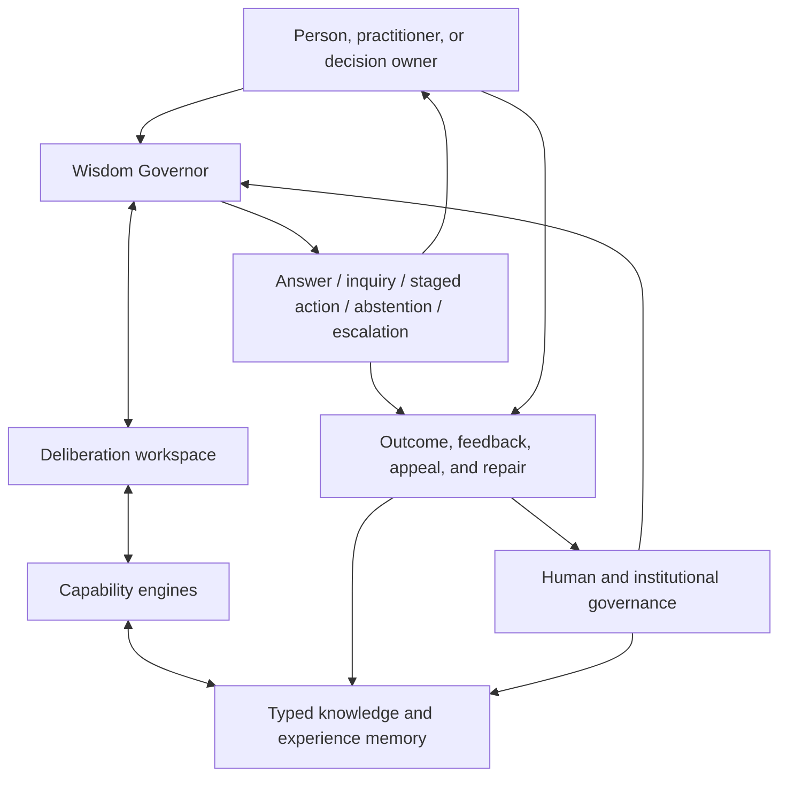
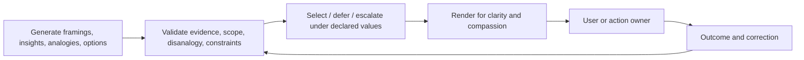

# General Artificial Wisdom Architecture

**Date:** 2026-08-07  
**Name used in this research:** GAWA — a descriptive abbreviation, not a product brand  
**Scope:** a domain-independent functional architecture that can be instantiated for religion/culture, medicine, law, leadership, finance, education, relationships, or other fields under separate authority  
**Claim:** candidate architecture for wisdom-supporting performance; no claim of machine consciousness, virtue, or validated autonomous wisdom

## 1. Architectural thesis

Artificial Wisdom should not be implemented as another knowledge store or a prompt that tells a model to “be wise.” It should be implemented as a governed cognitive system over time with explicit separation among:

1. **representation:** what is known, believed, disputed, practiced, hypothesized, valued, and observed;
2. **generation:** candidate framings, explanations, patterns, analogies, and actions;
3. **validation:** evidence, causal assumptions, counterexamples, disanalogies, constraints, and uncertainty;
4. **selection:** context-sensitive judgment about what to do, say, ask, defer, or withhold;
5. **expression:** communication fitted to the person without changing epistemic force;
6. **experience:** reviewed records of decisions, actions, outcomes, correction, and repair;
7. **governance:** legitimate authority over values, data, action rights, review, and appeals.

The central component is a **Wisdom Governor**. It is not an oracle. It is a meta-controller that qualifies the situation, chooses which capabilities and evidence are needed, enforces boundaries, and records the basis and uncertainty of the result.

## 2. System boundary

The architecture is a socio-technical system:



The generative model is inside **capability engines**, not at the top of the authority hierarchy.

## 3. Architectural planes

### 3.1 Governance plane

Defines who may decide and what the system may do.

Contents:

- domain purpose and claim ceiling;
- protected rights and hard constraints;
- value commitments and unresolved pluralism;
- authority and delegation boundaries;
- user consent and data-use rules;
- action permissions by risk tier;
- reviewer eligibility and conflicts of interest;
- appeals, correction, incident, and repair processes;
- dependency and relational-boundary policy;
- version and effective date.

This plane is human-governed. A model may identify conflicts or draft proposals; it cannot legitimate its own constitution.

### 3.2 Epistemic plane

Represents the external world and the state of evidence.

Contents:

- sources and immutable representations;
- atomic and composite claims;
- evidence-for, evidence-against, warrants, and defeaters;
- interpretations and perspective/authority;
- entities and relationships;
- procedures and applicability;
- causal and temporal hypotheses/models;
- uncertainty type and scope;
- version history and contradiction.

### 3.3 Experiential plane

Represents situated practice and learning over time.

Contents:

- thick cases;
- actors, roles, culture, institutions, and material constraints;
- decisions, actions, alternatives, and reasons;
- forecasts and confidence made before outcomes;
- outcome observations by affected perspective and time horizon;
- luck/model-identification caveats;
- repairs and later reviews;
- analogies, disanalogies, and adaptation history.

### 3.4 Abstraction plane

Represents reusable understanding above individual cases.

Contents:

- concepts and mechanisms;
- schemas and patterns;
- counter-patterns and anti-patterns;
- invariant/variant features;
- counterexamples and scope boundaries;
- predictions and decision implications;
- maturity state: proposed, challenged, supported, domain-qualified, retired;
- derivation from cases/evidence and reviewer disagreement.

### 3.5 Cognitive plane

Contains engines that perform bounded functions:

- language and multimodal interpretation;
- lexical/semantic retrieval;
- exact computation;
- claim/evidence assembly;
- domain expert models or tools;
- case retrieval;
- structural analogy;
- pattern induction;
- causal/temporal reasoning;
- argument and conflict analysis;
- forecasting and uncertainty estimation;
- stakeholder/perspective and power analysis;
- option generation and robust decision analysis;
- adversarial challenge and policy checks;
- explanation and rendering.

Every engine declares its domain, evidence needs, calibration status, latency/cost, and known failure modes.

### 3.6 Metacognitive plane: the Wisdom Governor

Monitors and controls the others. Its output is a deliberation plan, not the substantive answer.

The Governor asks:

```text
What kind of problem is this?
What is at stake and for whom?
What is missing?
Which source, case, expert, model, or perspective is competent here?
How novel is the situation?
How valid is feedback in this domain?
Are values or authorities disputed?
Is action reversible, delay costly, or experimentation safe?
What could be a severe or hidden failure?
Does the system have authority to answer or act?
What level of reasoning and review is proportionate?
What record and follow-up are required?
```

### 3.7 Interaction plane

Acquires context, communicates results, preserves agency, and supports follow-up. It is explicitly downstream of epistemic selection so that personalization and eloquence cannot silently alter certainty or normative status.

## 4. The Wisdom Governor in detail

### 4.1 Inputs

```yaml
request:
  content:
  modality:
  requested_role:
  requested_action:
context:
  person_or_population:
  goals_and_values:
  location_and_time:
  relationships_and_roles:
  cultural_or_institutional_setting:
  constraints_and_resources:
  emotional_state_if_volunteered_or_confirmed:
risk:
  stakes:
  reversibility:
  urgency:
  vulnerable_parties:
  legal_or_professional_boundary:
epistemic_state:
  available_sources:
  domain_model_validity:
  novelty_or_distribution_shift:
  disagreement:
  known_unknowns:
governance:
  domain_contract_version:
  user_consent:
  system_authority:
  escalation_routes:
```

### 4.2 Situation vector

The Governor computes a qualitative/quantitative vector rather than one risk score:

```text
ambiguity
novelty
epistemic uncertainty
normative conflict
stakeholder breadth
power asymmetry
temporal horizon
irreversibility
urgency
feedback validity
authority gap
dependency/manipulation risk
```

Thresholds route work but remain visible and versioned. A high average cannot cancel a hard authority gap or severe irreversible risk.

### 4.3 Risk tiers

| Tier | Typical request | Default path | Action authority |
|---|---|---|---|
| 0: deterministic/exact | calculation, exact source fact, schedule from trusted tool | direct tool/retrieval + concise answer | answer only |
| 1: explanatory/low stakes | concept, comparison, ordinary planning | grounded synthesis, scoped caveat | advice/information |
| 2: consequential/ambiguous | life decision, disputed interpretation, meaningful financial/relational choice | context acquisition + cases/patterns + perspectives + consequence stress test | user decides; follow-up offered |
| 3: high stakes/irreversible/authority-bound | medical/legal crisis, self-harm, coercion, sacred/professional adjudication, action affecting others | safety/professional protocol + minimal supportive help + escalation/authorized review | no autonomous consequential action unless explicitly governed |

Risk tier selects effort; it does not define truth.

### 4.4 Plan object

```json
{
  "problem_type": ["decision", "moral_conflict"],
  "risk_tier": 2,
  "missing_context": ["affected_party_view", "time_horizon"],
  "clarification_value": "high",
  "required_engines": [
    "evidence_retrieval",
    "case_retrieval",
    "disanalogy_check",
    "stakeholder_power_analysis",
    "consequence_scenarios"
  ],
  "required_independence": ["external_domain_review_if_actionable"],
  "hard_constraints": ["no_coercion", "preserve_user_agency"],
  "decision_modes_allowed": ["clarify", "recommend_reversible_trial", "defer"],
  "record_level": "auditable_summary",
  "follow_up": "outcome_check"
}
```

## 5. Deliberation cycle

The full cycle is named **Q-U-A-L-I-A** for reference only; the name carries no claim about consciousness.

### Q — Qualify

- classify problem and risk;
- detect premise errors, role requests, manipulation, and authority boundaries;
- identify missing context and whether clarification is worth its cost;
- decide whether the correct response is direct, exploratory, supportive, or escalatory.

### U — Understand

- retrieve the smallest sufficient evidence packet;
- build multiple candidate framings/models;
- retrieve cases, procedures, patterns, and counter-patterns as appropriate;
- distinguish fact, interpretation, causal hypothesis, norm, and preference;
- move between concrete details and relational abstraction.

### A — Adversarially test

- retrieve contradicting evidence and counterexamples;
- test analogy/disanalogy and scope;
- role-swap and self-interest-flip;
- examine power, absent parties, and distributional burden;
- challenge causal assumptions and outcome confidence;
- check current capability/calibration and policy boundaries.

### L — Locate values and legitimacy

- identify the user's values without simply endorsing them;
- apply legitimate domain constraints;
- represent competing ethical/practical frameworks when material;
- distinguish protected rights from tradeable preferences;
- expose unresolved moral remainder and authority gaps.

### I — Imagine consequences and options

- generate action, inquiry, staged trial, inaction, deferral, and escalation options;
- consider direct/indirect and short/long consequences;
- identify reversibility, option value, failure containment, and repair;
- use quantitative forecasts only where reference classes or models justify them.

### A — Act/answer and adapt

- select a proportionate response or explain why selection cannot be legitimate;
- render concisely with evidence and uncertainty appropriate to the user;
- record an inspectable decision summary;
- follow outcomes, accept correction, repair, and update at the right level.

Simple cases can skip most steps. A deterministic answer should not be burdened with ceremonial deliberation.

## 6. Separation of generation, validation, selection, and rendering



Rules:

- a generated insight is `proposed`, never `accepted` by generation alone;
- a validator cannot silently create missing evidence;
- selection records residual conflict and authority;
- rendering cannot increase confidence, remove material caveats, or invent consensus;
- the same model may implement multiple functions in an MVP, but functions use separate inputs, outputs, tests, and correlated-error warnings;
- high-risk validation requires different evidence or an independently governed reviewer, not merely a new persona.

## 7. Typed memory model

### 7.1 Source and evidence memory

Immutable source identities, representations, spans, rights/use conditions, and provenance. Derived text never masquerades as an original.

### 7.2 Semantic/claim memory

Claims and interpretations are versioned, scoped, and linked to support, opposition, warrant, and defeaters.

### 7.3 Procedural/skill memory

Procedures contain prerequisites, applicability, steps, alternatives, safety/authority bounds, success criteria, and variation.

### 7.4 Case and outcome memory

Cases contain situation, actors, context, decision, action, expectations, outcomes by horizon/perspective, uncertainty, review, and privacy/consent.

### 7.5 Pattern memory

Patterns are derived hypotheses with source cases, relational schema, mechanism status, counterexamples, scope, predictions, maturity, and version.

### 7.6 Normative memory

Values, rights, duties, virtues, professional codes, laws, cultural commitments, and domain policies retain source, authority, jurisdiction/community, dissent, priority, and effective date.

### 7.7 Deliberation memory

Stores only an auditable summary: question, context used, evidence, candidate framings/options, material conflicts, tests invoked, selected response, confidence, authority, follow-up. It does not store or expose hidden chain-of-thought.

### 7.8 Capability memory

Versioned registry of engines/models/tools, domains, evaluation results, calibration, known failures, costs, and allowed uses. The Governor routes by evidence, not brand prestige.

## 8. Core data sketches

These sketches are technology-neutral.

```typescript
type EpistemicStatus =
  | "observed" | "reported" | "interpreted" | "inferred"
  | "hypothesized" | "contested" | "superseded" | "unknown";

interface Assertion {
  id: string;
  proposition: string;
  kind: "fact" | "interpretation" | "causal" | "normative" | "forecast";
  scope: Scope;
  epistemicStatus: EpistemicStatus;
  evidence: EvidenceLink[];
  defeaters: Defeater[];
  uncertainty: Uncertainty;
  provenance: Provenance;
  version: Version;
}

interface Case {
  id: string;
  situation: SituationFeatures;
  actors: ActorRole[];
  culturalInstitutionalContext: Scope;
  goalsValuesConstraints: Commitment[];
  optionsConsidered: Option[];
  decision?: Decision;
  action?: ActionRecord;
  exAnteForecasts: Forecast[];
  outcomes: OutcomeObservation[];
  causalInterpretations: Assertion[];
  reviews: Review[];
  consentAndAccess: GovernanceRef;
  version: Version;
}

interface PatternHypothesis {
  id: string;
  name: string;
  relationalSchema: Relation[];
  derivedFromCases: string[];
  negativeCases: string[];
  invariantFeatures: Feature[];
  varyingFeatures: Feature[];
  mechanismStatus: "descriptive" | "causal_hypothesis" | "causally_supported";
  scope: Scope;
  predictions: Prediction[];
  counterexamples: Counterexample[];
  harmsIfMisapplied: string[];
  maturity: "proposed" | "challenged" | "supported" | "domain_qualified" | "retired";
  provenance: Provenance;
  version: Version;
}

interface NormativeCommitment {
  id: string;
  statement: string;
  kind: "right" | "duty" | "value" | "virtue" | "policy" | "law" | "preference";
  authority: Authority;
  scope: Scope;
  priorityType: "hard_constraint" | "presumptive" | "tradeable" | "advisory";
  conflictsWith: string[];
  dissent: Interpretation[];
  effectiveVersion: Version;
}

interface DeliberationRecord {
  id: string;
  requestDigest: string;
  contextDigest: string;
  plan: DeliberationPlan;
  sourcesAndCasesUsed: string[];
  candidateFramings: Summary[];
  candidateOptions: Summary[];
  materialConflictsAndDefeaters: Summary[];
  decision: "answer" | "ask" | "recommend" | "defer" | "abstain" | "escalate";
  selectedResponseBasis: Summary;
  residualUncertainty: Uncertainty[];
  authorityAndPolicy: GovernanceRef[];
  rendererTransform: RendererAudit;
  followUp?: FollowUpPlan;
  createdAt: string;
}
```

## 9. Capability engine contract

Every engine exposes the same control surface even if implemented by an LLM, a solver, a database, a human panel, or a deterministic tool.

```typescript
interface CapabilityManifest {
  id: string;
  function: string;
  competentScopes: Scope[];
  excludedScopes: Scope[];
  requiredInputs: string[];
  outputSchema: string;
  evaluationArtifact: string;
  calibrationArtifact?: string;
  knownFailureModes: string[];
  independenceClass: string;
  costClass: "low" | "medium" | "high";
  latencyClass: "instant" | "interactive" | "deferred";
  allowedRiskTiers: number[];
  version: string;
}

interface CapabilityResult<T> {
  result: T;
  evidenceRefs: string[];
  assumptions: string[];
  uncertainty: Uncertainty[];
  detectedOutOfScope: boolean;
  testablePredictions?: string[];
  failureWarnings: string[];
}
```

The Governor should prefer a cheap competent engine but must not route beyond evaluated scope merely to save cost.

## 10. API sketch

```http
POST /v1/wisdom/qualify
  -> situation vector, risk tier, missing context, authority, proposed plan

POST /v1/wisdom/context
  -> context card with confirmed, inferred, missing, and private fields

POST /v1/wisdom/deliberate
  -> bounded deliberation result and record id

GET /v1/wisdom/deliberations/{id}
  -> inspectable summary, evidence, alternatives, residual uncertainty, policy version

POST /v1/wisdom/outcomes
  -> consented action/outcome observation by stakeholder and horizon

POST /v1/wisdom/review
  -> correction, disagreement, appeal, harm, or expert review

POST /v1/wisdom/patterns/propose
  -> proposed abstraction linked to cases and predicted tests

POST /v1/wisdom/patterns/{id}/challenge
  -> counterexample, scope challenge, causal alternative, or cultural objection

POST /v1/wisdom/patterns/{id}/promote
  -> governed maturity transition; never model self-promotion

GET /v1/wisdom/capabilities
  -> manifests and current evaluated bounds
```

Example deliberate response:

```json
{
  "mode": "recommend_reversible_trial",
  "answer": "...",
  "basis": {
    "evidence": ["assertion:..."],
    "cases": ["case:..."],
    "patterns": ["pattern:..."],
    "normative_commitments": ["norm:..."]
  },
  "alternatives": ["..."],
  "material_uncertainty": ["..."],
  "would_change_if": ["..."],
  "authority": "user_decision",
  "follow_up": {"after": "14 days", "observe": ["..."]},
  "deliberation_record_id": "delib:..."
}
```

## 11. Offline synthesis versus inference-time work

### Offline, reviewed, versioned

- source normalization and provenance;
- claim and interpretation extraction;
- conflict and applicability annotation;
- procedure validation;
- case de-identification, consent, and outcome review;
- pattern proposal, counterexample search, and maturity review;
- domain charter and normative-policy governance;
- capability evaluation/calibration;
- representative scenario suites and adjudication rubrics;
- common-sense defaults with cultural scope and known harms.

### Inference time

- user/context qualification;
- deciding whether clarification is worth asking;
- retrieving the smallest sufficient combination of source, claim, procedure, case, pattern, and counterexample;
- generating situation-specific framings and options;
- testing analogies and consequence hypotheses;
- applying current policy/authority;
- proportional selection and rendering;
- recording the bounded decision summary.

### Never silently promoted at inference time

- a generated fact to accepted knowledge;
- one user's story to a general case;
- one outcome to causal evidence;
- a generated analogy to an accepted pattern;
- a preference to a universal value;
- a persuasive response to a validated wisdom example;

## 12. Retrieval planner

| Need | Primary target | Secondary target | Mandatory checks |
|---|---|---|---|
| exact fact | source span / deterministic tool | scoped claim | identity, time, provenance |
| explanation | claims + relational/causal model | sources + countermodel | causal status, competing explanation |
| how-to/procedure | validated procedure | source + practice cases | applicability, prerequisites, authority, variants |
| precedent/practical case | case + outcome trajectory | pattern + source evidence | disanalogy, selection bias, causal uncertainty |
| novel insight | diverse cases + structural relations | pattern hypotheses + counterexamples | novelty, predictive gain, scope, independent validation |
| ambiguous guidance | context + cases + commitments | patterns, arguments, consequences | affected parties, power, reversibility, uncertainty |
| moral conflict | normative commitments + argument graph | cases + consequence models | authority, rights, dissent, moral remainder |
| forecast | reference class / calibrated model | cases + causal hypotheses | base rate, resolution criterion, calibration |
| reflection | prior deliberation + actual outcome | cases/patterns | hindsight bias, luck, correct update level |
| emotional support | confirmed context + communication policy | relevant practical resources | no diagnosis/pretended feeling, safety escalation |

## 13. Conflict and graceful-failure policy

When sources, models, values, or stakeholders conflict:

1. identify whether conflict is factual, interpretive, causal, normative, procedural, or priority-based;
2. preserve attributed positions and their strongest evidence;
3. distinguish resolvable missing evidence from legitimate pluralism;
4. seek high-value clarification or independent expertise;
5. apply legitimate hard constraints and authority limits;
6. prefer reversible information-gaining action where appropriate;
7. state residual conflict and who must decide;
8. abstain or escalate when the system cannot act legitimately.

Graceful failure is not a generic refusal. It offers the safest useful remainder:

- what is known;
- what is disputed or missing;
- what can be done safely now;
- who is competent/authorized to help;
- what evidence would change the situation.

## 14. Rhetoric and charisma firewall

The renderer receives a selected content object with immutable fields:

```yaml
claims_and_epistemic_force:
recommendation_and_authority:
material_alternatives:
material_uncertainty:
required_warning_or_citation:
prohibited_implications:
```

It may change language, length, order, examples, and tone. It may not:

- turn “may” into “will”;
- remove a materially different interpretation;
- turn a user choice into system authority;
- add prestige or sacred authority;
- claim feelings or lived experience;
- use dependency-building or coercive language;
- conceal evidence weakness to sound concise.

An automated semantic diff plus adversarial tests should compare the selected content and rendered answer.

## 15. Learning and versioning

### Update levels

| Evidence | Allowed default update | Prohibited default update |
|---|---|---|
| corrected source metadata | source record/version | normative policy |
| new contradictory source | claim status/conflict | deletion of prior position |
| one case outcome | case and calibration observation | universal pattern promotion |
| repeated reviewed outcomes | domain pattern/model challenge | automatic causal claim |
| prospective causal evidence | scoped causal model | transfer beyond studied population |
| user satisfaction | communication preference | truth/value/recommendation quality |
| harm report | incident, pause/escalation, review | dismissal as outlier without investigation |
| governance decision | policy version with authority | retroactive rewriting of prior decision record |

All derived artifacts retain `derived_from`, reviewer, method, version, and supersession links. Rollback restores an earlier policy/model/pattern without erasing what happened under later versions.

## 16. Security, privacy, and relational safety

Wisdom systems invite highly sensitive context. Minimum requirements:

- collect only context with material decision value;
- mark confirmed versus inferred personal facts;
- obtain explicit consent for durable case/outcome retention;
- separate private user memory from general learning;
- prevent other-user retrieval and re-identification;
- allow correction, export, and deletion where legally/contractually appropriate;
- do not infer protected or intimate traits unless necessary, authorized, and confirmed;
- monitor dependency, exclusivity, manipulative personalization, and authority inflation;
- do not learn general values from private distress or coerced contexts.

## 17. What can be omitted in a fast implementation

A bounded first version does not require:

- a native graph database;
- formal argumentation semantics;
- a learned world model;
- autonomous online learning;
- multiple agents for every answer;
- artificial emotion;
- a universal value ontology;
- numerical moral weights;
- hidden chain-of-thought storage;
- a general causal inference engine;
- a claim that the system is wise.

It does require functional separation, an inspectable record, a domain contract, a strong baseline, and evaluation that can fail the hypothesis.

## 18. Architecture falsification criteria

Reject or simplify GAWA if controlled evaluation shows that:

1. a strong grounded model with the same evidence matches judgment, calibration, transfer, and severe-error rates;
2. the Governor adds verbose questions without improving decisions;
3. cases/patterns increase analogy and stereotyping errors;
4. structured records create false certainty from model-extracted fields;
5. human reviewers cannot agree on material distinctions even with adjudication;
6. outcome learning rewards satisfaction or conformity rather than benefit;
7. users overtrust the system more because of architecture language or displayed deliberation;
8. operational complexity prevents timely correction or safe governance.

The objective is not to preserve the architecture. It is to preserve measurable wisdom-supporting functions with the simplest mechanism that works.
